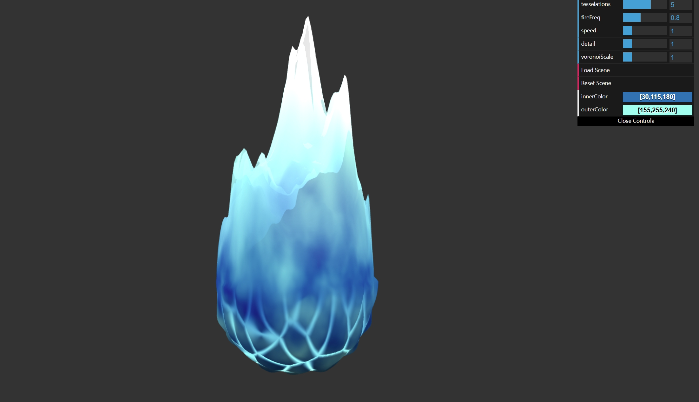

# [Project 1: Fire Ball](https://github.com/CIS-566-Fall-2022/hw01-fireball-base)

## Zhen Ren 
### [Live Demo](https://zhiqing-r.github.io/hw01-fireball/)

## Details
- Used simplex noise and fbm to simulate the fire
- Used worley noise to simulate lava pattern at the bottom
- Used power curve and cosine curve to refine the fire shape
- Used simplex noise to add details to the surface color

## Interactable Settings
- Speed: waving speed of fire.
- Fire frequency: Frequency of fire waves.
- Detail: scale of surface color pattern.
- Voronoi scale: Scale of bottom pattern.
- Inner color & Outer color: Color of the fire.
- Many interesting themes:
  - Ghost
  - Cherry
  - Evening
